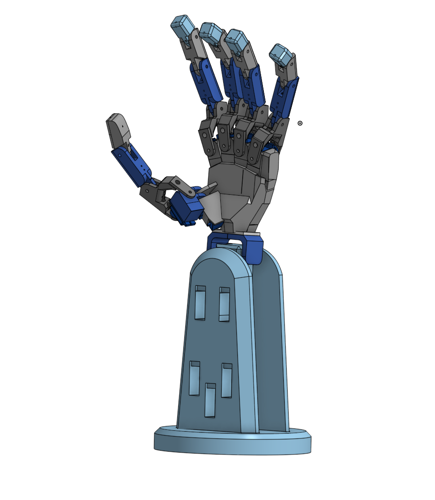
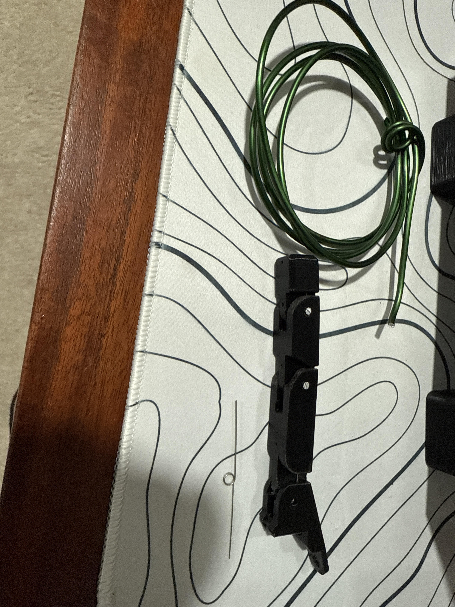
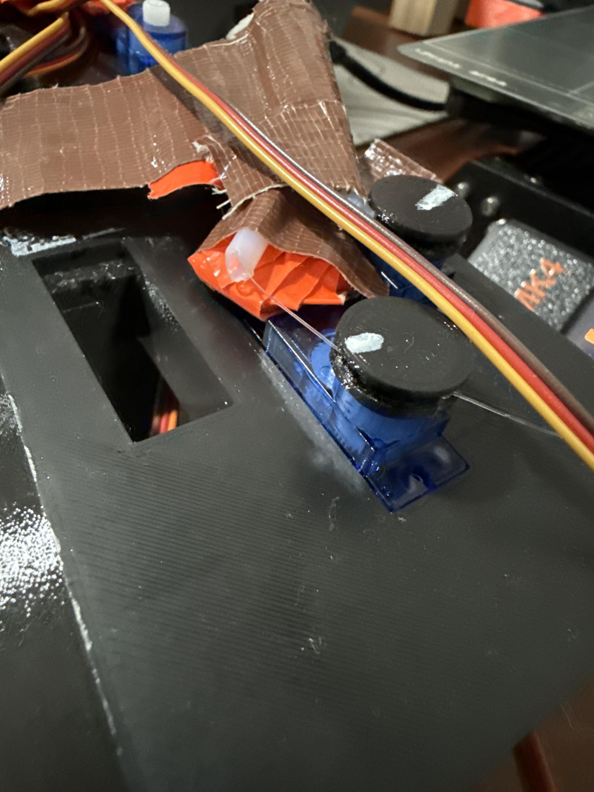
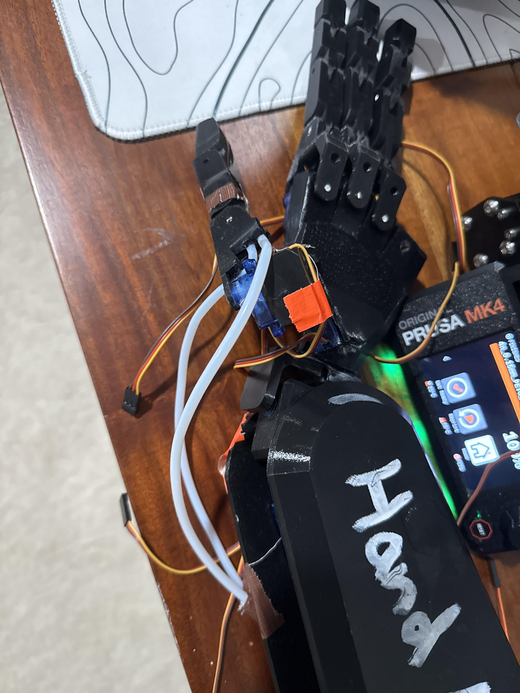

# RoboHand
My work-in-progress, 18 degrees of freedom bionic hand, which is designed to be light, portable, 3d printed, and camera controlled. My end goal for this project is to have it easily replicable, and a fun project that anyone can build!

# Version 1.0 Mechanics

## CAD Screenshot

[CAD_View_Link](https://cad.onshape.com/documents/86bf4dfd6a1848240d249c8c/w/50c44644a75c750186f3763e/e/51c8a8d030c6fc09a35cee1b?renderMode=0&uiState=696f19a21f361409ffdfdc05)
This is my initial CAD for my hand project. The Springs, Wires, Tubes, and other essential components are not added in the CAD. Furthermore, the parts are not optimised for 3D printing and do not have adequate tolerance. Post-processing is required at this stage.

## Finger Assembly

This is the basic finger assembly. Each joint has a tortion spring and 3mm wire to hold it together. This means that as a finger is released by the motor, there is no need for a second one to bring it back upwards, saving weight and complexity. Parts are 3D printed from PETG and post-proccessed with sandpaper.

## Tendon System

Each finger is powered by a tendon system. Fishing line is routed up, and is powered by a motor with a spool on it. 9g servos with a 360 degree freedom mod are used. The fishing line has specific channels inside each printed part that they are to be routed through. Not all 3D-Printers may be able to sucessfully replicate this. In order to improve off of existing designs, I powered the metacarpal joint with its own tendon, and the PIP and DIP joints simultaneously with another, allowing for an extra degree of freedom. This means that while many other designs have 2 definite positions for each finger (open & closed), this one has 4.

## Tube Usage

To better manage the tendons, as well as to allow for more dexterous wrist movements, PTFE tubing is used. Without tubing, a wrist movement may increase the tension on a specific tendon, flexing the finger unintentionally. 

# Version 1.0 Programming:
This project will run on 3 seperate programs. Program 1(Python) will look at the users hands, converting the coordinates of each joint into angles. Program 2(Python) will look at the robot hand, to confirm when the robot has completed any commands, due to the lack of internal sensors(other than crude servo potentiometers). Finally, program 3(C++) will send these commands to a microcontroller, and have the required motors carry out the commands(using serial communication).

## Program 1
[Program_1](src/AngleCalc_User)
Future Improvements: The code works great as of now, however, at the beggining of a finger movement, the PIP and DIP joints are not very responsive. I plan to fix this in the future.
